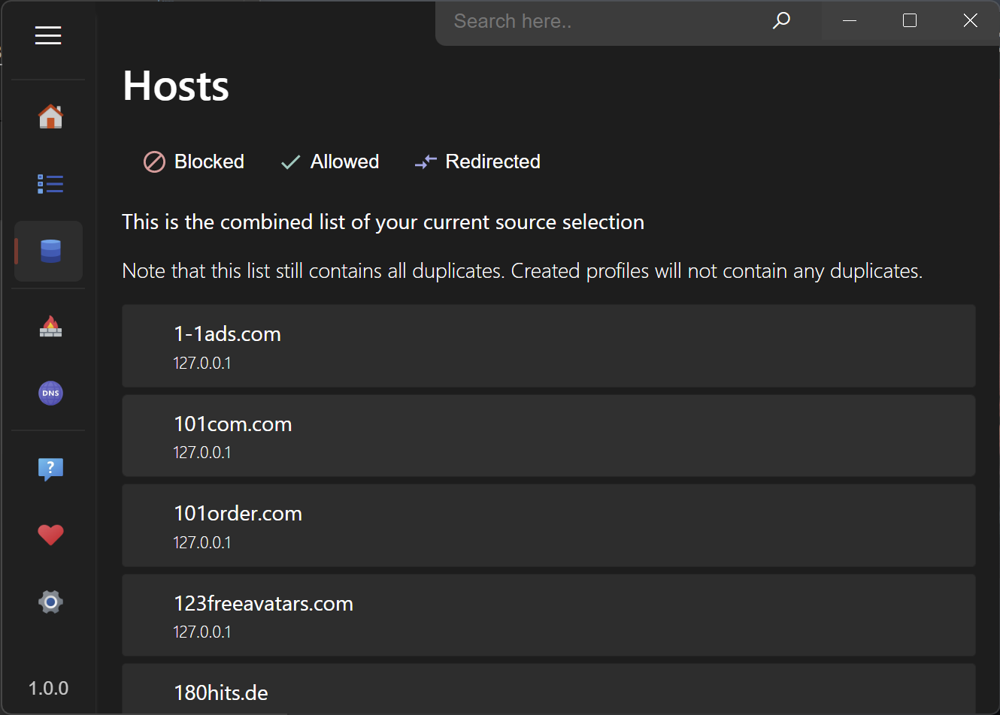

#  hosts_manager

`hosts_manager` can manage your system's hosts file. This is used primarily for Ad-blocking purpose. You can include online-sources or custom files. `hosts_manager` includes a list of common Ad-Blocking files. Additionally it provides a modern interface for Windows-Firewall rules.

## Availability

`hosts_manager` was initially created for Windows, but could also be built for Linux/Mac with minimal changes.

## Features

- Edit hosts-file
- Create multiple hosts-profiles for quick change
- Automatically optimize hosts-profiles (e.g. remove duplicates)
- Supports comments on every line
- Compatible with PowerToys Hosts-Editor
- Test DNS-queries
- View and edit firewall rules
- Drag-n-drop host files

## Screenshots

## Related projects

- [AdAway](https://adaway.org): hosts-based AdBlocker for Android (root)

## Included hosts-files

- [AdAway](https://adaway.org/hosts.txt)
- [Pete Lowe blocklist hosts](https://pgl.yoyo.org/adservers/serverlist.php?hostformat=hosts&showintro=0&mimetype=plaintext)
- [StevenBlack's hosts](https://github.com/StevenBlack/hosts)
- [Ultimate Hosts Blacklist](https://github.com/Ultimate-Hosts-Blacklist/Ultimate.Hosts.Blacklist)
- [lightswitch05's hosts](https://github.com/lightswitch05/hosts)
- [ADios](https://github.com/AlexRabbit/ADios)

## Known issues

- Currently the firewall-manager gets no feedback if changes were successful or not. This does not affect enabling/disabling the firewall or rules and the removal of rules, but on `edit` and `new`.

## Troubleshooting

A wrong configured hosts-file can lead to problems with the Windows DNS-Client. If the DNS-Client blocks access to the hosts-file, you cannot edit it anymore.

- disable the DNS-Client `REG add “HKLM\SYSTEM\CurrentControlSet\services\dnscache” /v Start /t REG_DWORD /d 4 /f`
- Reboot and delete or backup the hosts file
- enable the DNS-Client `REG add “HKLM\SYSTEM\CurrentControlSet\services\dnscache” /v Start /t REG_DWORD /d 2 /f`
